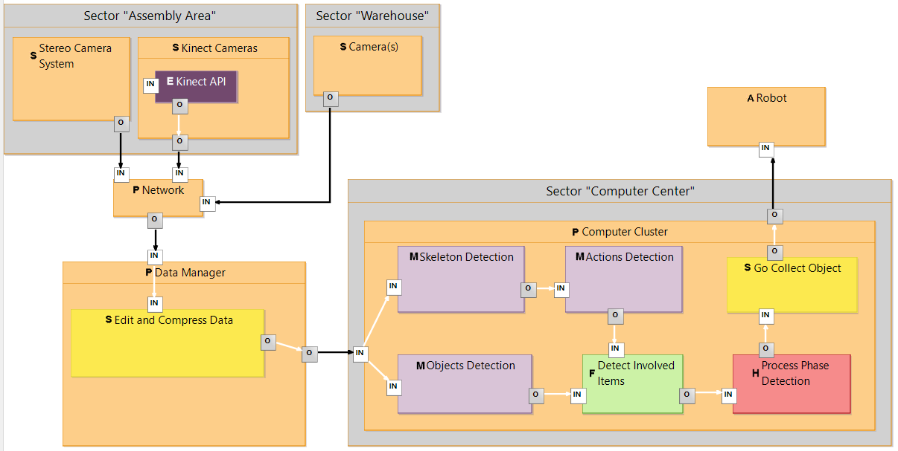
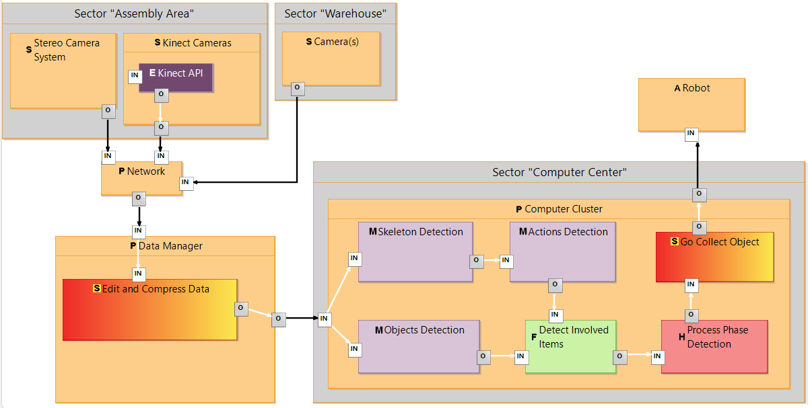
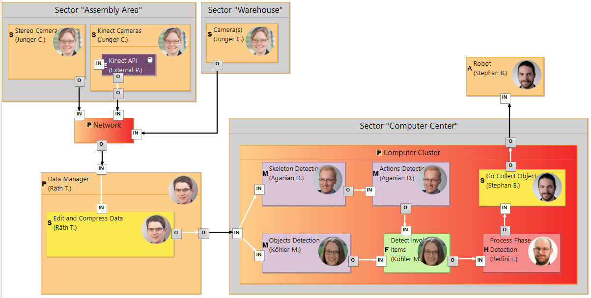

# E4SM Sirius Editor
 [[_TOC_]]

# Diagram Types
It is possible to visualize different aspects of the same model through different views (i.e. kinds of diagrams).

## Data Transfer Diagram (DTD)

A DTD diagram shows how the different components share data.

### Layers
Layers allow to temporarily change how some properties or elements are shown on the diagram.

Multiple Layers may be enabled at the same time, some layers may be enabled by default.

#### Generic Elements

This layer highlights generic elements and connectors which still need to be specified to a more specific component.

#### Responsibilities

This Layer adds a picture and a tooltip to all elements which have a main responsible specified, and highlights elements which currently have no main responsible.

A responsible automatically inherits all components contained in his/her components.
It is possible to change this by assigning another responsible to a subcomponent.

External components, by default, do not have a main responsible.

### Top-down components specification
It is possible to specify a component in a new view (which shows a package), only if the component does not contain any other component.

## Person Management Table (PM)
This table allow to visualize all persons available in the model.
The user can also add or delete existing ones.

# Analysis Methods
Please refer to [the main Readme file](../../README.md#analysis-objectives) for the possible analysis goals.

# Functionalities
- *Drag & Drop*:
  - it is possible to drag & drop *input and output pins* from one component to another. Connected edges will be moved, too.
  - it is possible to move a Sector (a collection of physical components) inside another sector or back outside.
- *Changing component types*: (Not yet implemented) it is possible to first define a component either as a generic, software, or physical component. The editor allows to specify each component to a more concrete instance (e.g. Sensor, Actuator, Machine Learning Component) in a second moment.
- *Renaming components*: Just click on a component and press F2 to rename it without accessing the properties panel.
